# Container Deployment on AWS

- we need aws cli version 2 and the latest docker
- authenticate using the cli `aws login`

### Creating a container repository for the api image

in aws, each image should have a repo that will contain all the images versions (tags)

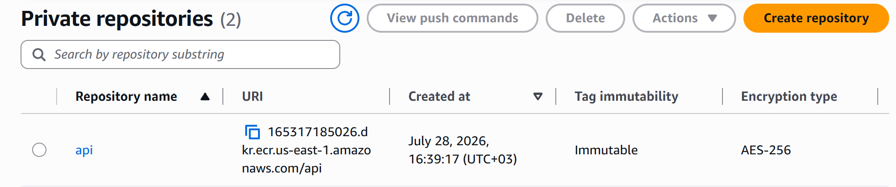

Make sure that the cli is using the same region where the repo is created (very important step)
also make sure that tags are immutable, for traceability purposes 

### Image deployment on Elastic Container Service (ECS)

we will create a cluster for the stack, one service for the api and the other for the database.

for the database image we will use the ECR public gallery image public.ecr.aws/docker/library/postgres:19beta2-alpine3.23

### create a security group 
the security group will be attached to the tasks (aws name for pods) to allow the HTTP request to the api application 

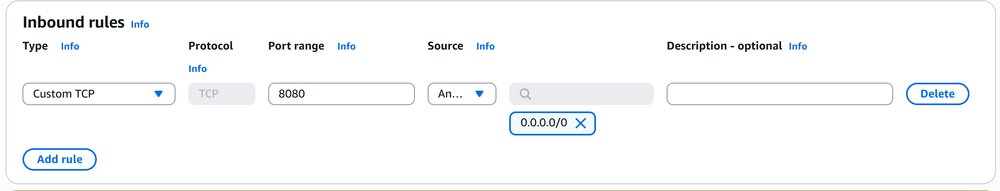

since the sg is stateful, we will not create an outbound rule

## create the cluster

we will use fargate as pods for the services (serverless and less expensive)

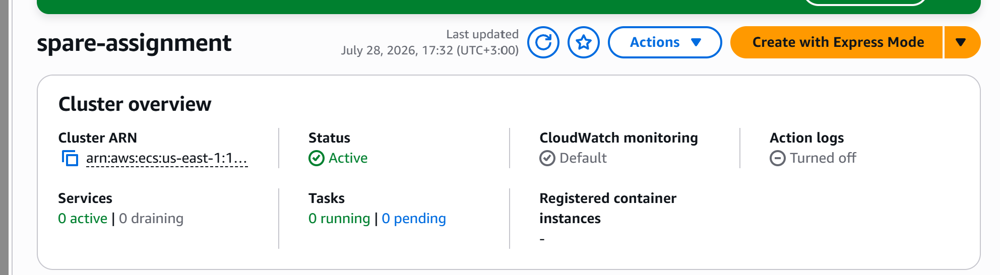

we then need to create tasks
both services (api and database) are going to be on the same task (larger apps requires different engineering on the cloud, like using a managed aws rds for the database or creating a separate task with persistent volume like EFS, but since our app is small and we want to keep it simple)

since we are not using any aws services, roles for the task are the default
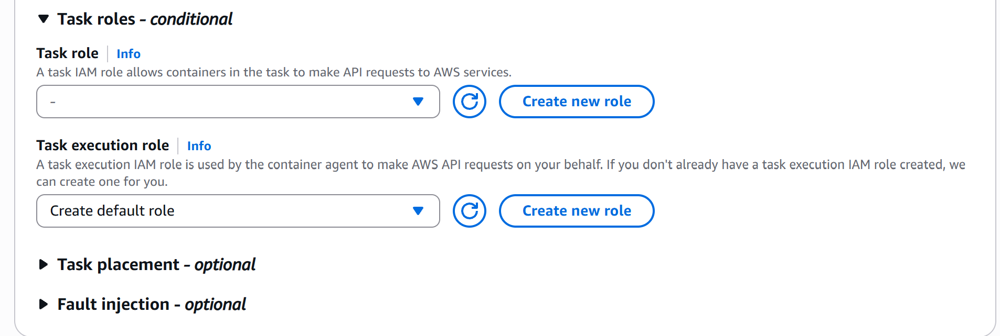

pulling the first image from the image we pushed to the registry 

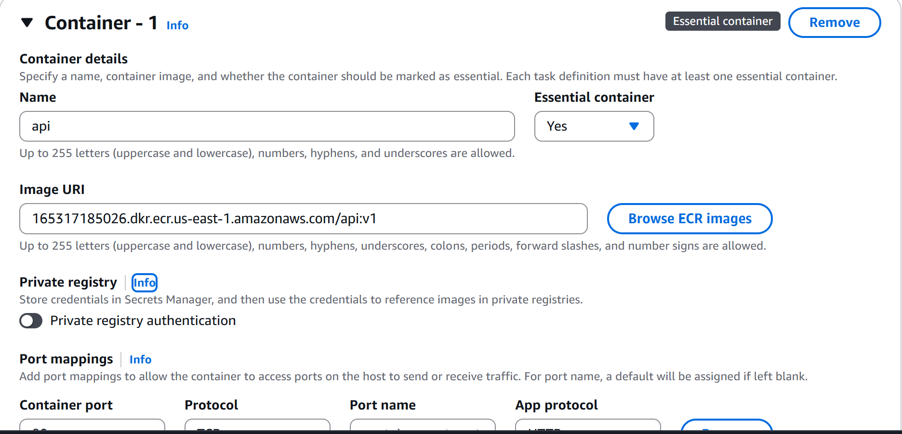

adding the container environment variables 

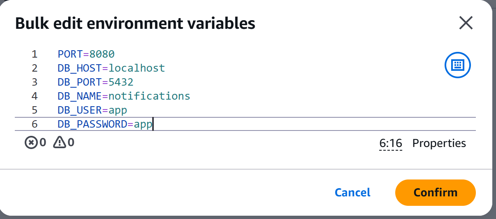

adding health checks

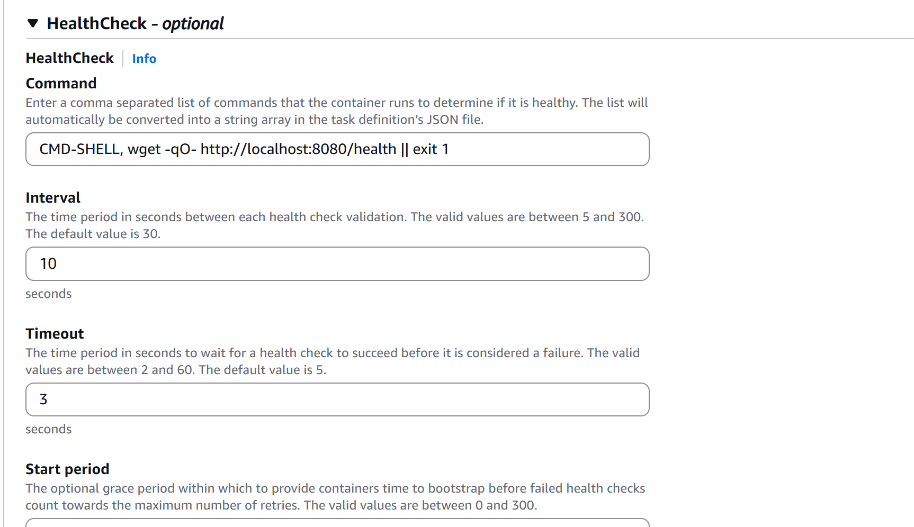

pulling second container from the gallery 

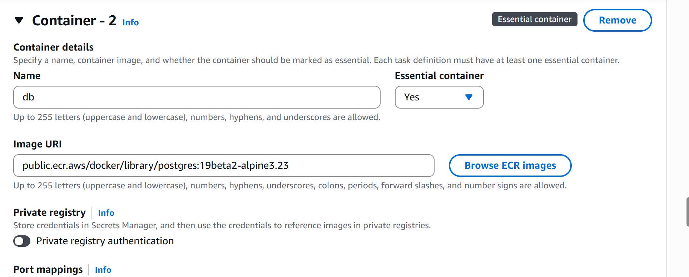

also adding health checks 

adding dependency on the dp for the api image

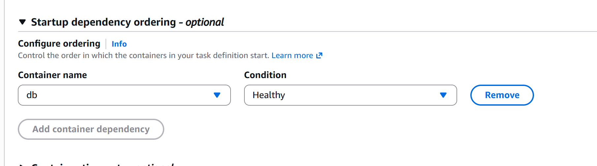

creating the volume that will be mounted to the db with EFS (you need to create one)

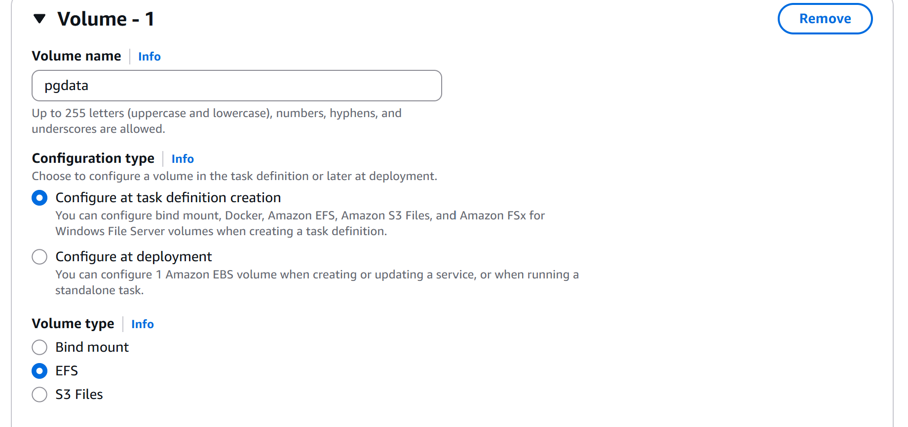

also add the same path on the container 

## running the task
selecting the task definition we have just created

turning on this option is very effective 

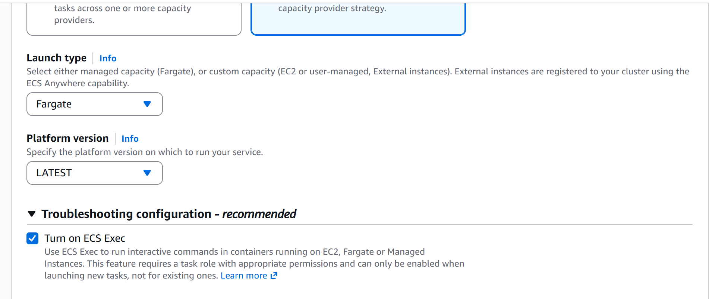

## Mistakes I've fallen into (don't)

- make sure that you allow NFS traffic to the EFS by editing the security group inbound rules and adding the security group you created in the first step as the source of the traffic

- create the path `/var/lib/postgresql/data` inside the EFS during the task definition or by mounting a small EC2 instances 